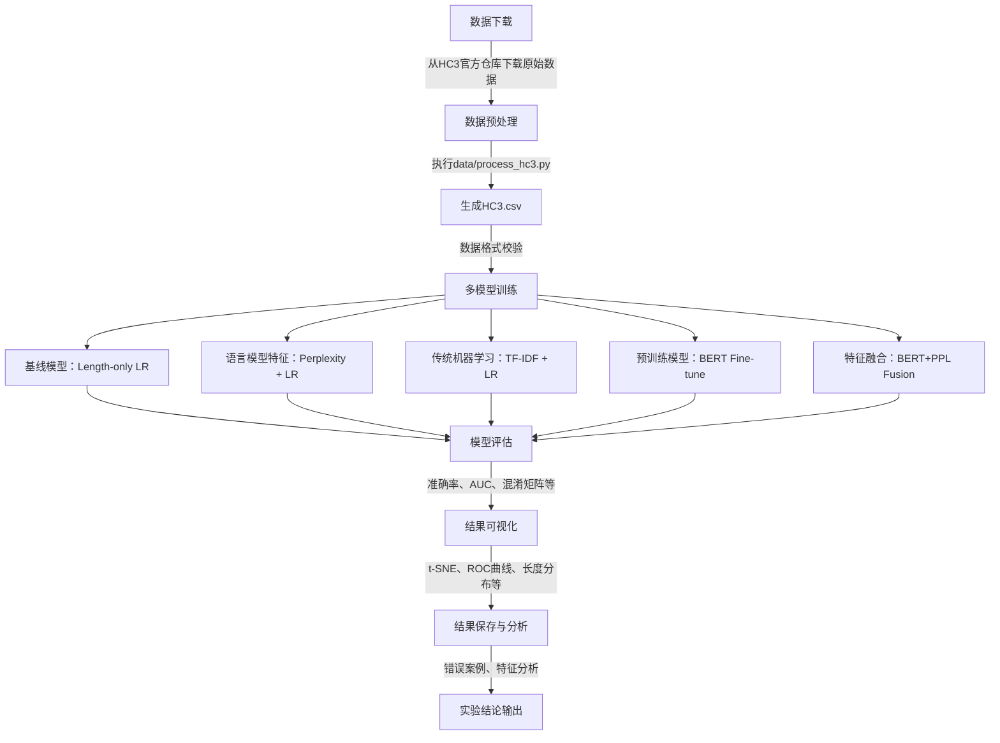
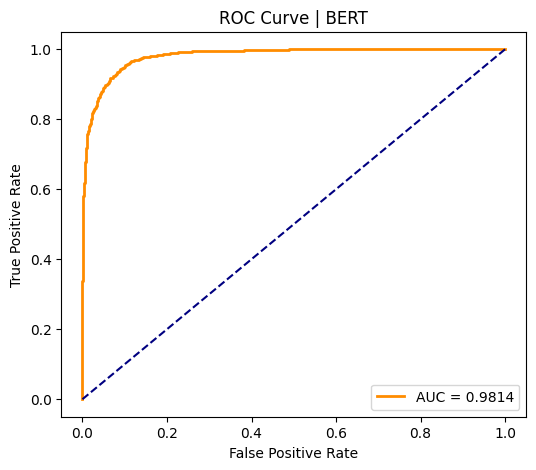
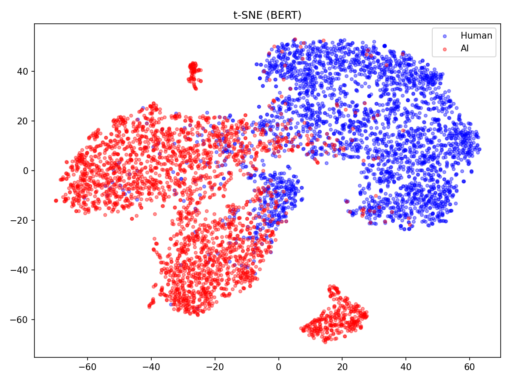
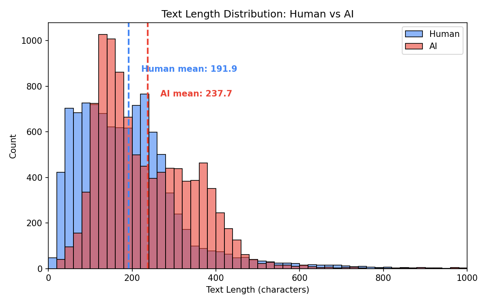

# AI 生成文本检测系统
# AI Text Detection System

A research-oriented project for detecting AI-generated text using statistical features, traditional NLP methods, and pretrained language models.

The project builds a progressive benchmark including:
- heuristic statistical features
- TF-IDF based machine learning
- BERT fine-tuning
- feature fusion experiments

The goal is to analyze how different feature representations contribute to human vs AI text classification.

> 基于多模型对比与特征融合的人机文本分类项目
---

## 项目简介
随着大模型生成内容的普及，AI生成文本与人工文本的边界越来越模糊。本项目以文本为研究对象，构建了一套完整的检测与对比实验框架，从传统统计特征、词袋模型到预训练语言模型，系统对比了不同方法在人机文本分类任务上的效果，并探索了语义特征与统计特征的融合方案。

本项目的核心亮点：
- 多模型对比：从启发式统计特征到预训练语言模型构建完整基准体系
- 特征工程：结合文本长度、困惑度、TF-IDF与BERT语义特征
- 特征融合：提出并验证了语义特征与统计特征的融合思路
- 完整评估：包含准确率、AUC、混淆矩阵、t-SNE可视化与错误案例分析
- AI辅助优化：借助AI工具辅助完善代码、排查bug、优化代码可读性与规范性，提升开发效率

---

## 项目流程图
以下为项目完整执行流程图，清晰呈现从数据输入到结果输出的全流程：


## 快速开始

### 1. 环境准备
```bash
# 克隆项目
git clone https://github.com/Chen-daydayup/AI-Text-Detection.git
cd AI-Text-Detection

# 安装依赖
pip install -r requirements.txt -i https://pypi.tuna.tsinghua.edu.cn/simple
```

### 2. 运行完整实验
```bash
export HF_ENDPOINT=https://hf-mirror.com
python main.py
```
⚠️ 注意：运行前请务必按照「数据集说明」章节的步骤，完成原始数据集的下载，并运行 `data/process_hc3.py` 脚本完成数据预处理，确保 `data/` 目录下存在预处理后的 `HC3.csv` 文件，否则将无法正常运行。
运行结束后，所有实验结果（图片、报告）将自动保存到 `results/` 目录下。

---

## 支持的模型与方法

| 模型类别         | 具体实现方式                               |
|------------------|--------------------------------------------|
| 基线统计特征     | 文本长度 + 逻辑回归                        |
| 语言模型特征     | 困惑度（GPT-2）+逻辑回归                  |
| 传统机器学习     | TF-IDF + 逻辑回归                          |
| 预训练语言模型   | BERT 微调                                  |
| 简单特征融合    | BERT 语义特征 + 困惑度特征融合 + 逻辑回归  |
| 深度特征融合     | BERT 语义特征 + 困惑度特征融合 + 端到端微调训练  |

---

## 项目结构
```text
AI-Text-Detection/
├── data/                     # 数据集目录
│   ├── all.jsonl      # 原始数据集（需自行下载）
│   ├── HC3.csv               # 预处理后数据集（自动生成）
│   └── process_hc3.py        # 数据预处理脚本
├── src/                      # 核心模块
│   ├── preprocess.py         # 数据加载与基础清洗工具
│   ├── length_model.py       # 文本长度基线模型
│   ├── perplexity_model.py   # 困惑度特征计算与模型
│   ├── tfidf_model.py        # TF-IDF模型
│   ├── bert_model.py         # BERT微调模型
|   ├── simple_fusion.py      # 简单的特征融合模型
│   ├── fusion_model.py       # 特征融合后参与微调
│   ├── evaluate.py           # 模型评估与可视化模块
├── results/                  # 自动生成的实验结果
│   ├── *.png                 # ROC曲线、t-SNE图、长度分布图等
│   ├── *.txt                 # 错误案例、实验结果汇总、特征分析
├── main.py                   # 项目入口文件
├── requirements.txt          # 项目依赖包列表
└── README.md                 # 项目说明文档
```

---

## 主要结果与可视化
运行后将自动生成以下关键结果：
1. **模型性能对比**
   - 各模型的准确率与AUC指标
   - 混淆矩阵与ROC曲线
2. **特征可视化**
   - TF-IDF、BERT 及融合特征的t-SNE降维对比图
   - 文本长度分布统计
3. **可解释性分析**
   - 高区分度的TF-IDF关键词列表
   - 错误分类案例分析

---

## 核心实验结论
### 实验结果汇总
以下为各模型在测试集上的实际性能表现，采用表格形式清晰对比：
| 模型名称           | 准确率 (Acc) | 曲线下面积 (AUC) |
|--------------------|--------------|------------------|
| Length-only LR     | 0.5405       | 0.6189           |
| Perplexity + LR    | 0.7240       | 0.7834           |
| TF-IDF + LR        | 0.7628       | 0.8463           |
| BERT Fine-tune     | 0.9170       | 0.9814           |
| Simple Fusion      | 0.8518       | 0.9299           |
| BERT+PPL Fusion    | 0.9143       | 0.9808           |

基于上述实验结果，得出以下结论：
1. 预训练语言模型（BERT Fine-tune）在该任务中表现最佳，准确率达到0.9170，AUC达到0.9814，显著优于传统机器学习方法。
2. 传统词法特征（TF-IDF）相比简单统计特征（Length、Perplexity）具有更强的判别能力，验证了词汇分布信息在人机文本区分中的作用。
3. 在简单的特征融合实验中，BERT语义特征与困惑度特征的Early Fusion未能进一步提升性能，主要原因有两点：一是融合结构中BERT仅用于固定特征提取，未针对任务微调；二是分类器采用逻辑回归，表达能力弱于BERT微调的非线性分类头。
4. BERT+PPL Fusion深度融合、并解决简单特征融合实验的两个主要问题后，模型性能与纯BERT结果基本接近，但未产生明显提升。融合模型准确率为0.9143，略低于纯BERT微调的0.9170。其原因主要在于：一方面，PPL刻画的是文本概率分布信息，而BERT在大规模语料预训练后已经能够隐式学习语言流畅度与上下文概率特征，因此两者存在一定信息重叠；另一方面，BERT输出为768维语义向量，而PPL仅为1维统计特征，在拼接表示中贡献较小，难以显著影响模型决策。因此，简单加入统计特征并未带来额外性能增益。


---

## 实验结果可视化示例
为更直观呈现实验效果，以下展示关键可视化结果：

### 1. 各模型 ROC 曲线对比

*注：BERT_ROC曲线*

### 2. BERT 语义特征 t-SNE 可视化

*注：t-SNE降维后，人工文本与AI生成文本呈现出较好的聚类效果，验证了BERT语义特征的判别能力。*

### 3. 文本长度分布对比

*注：人工文本与AI生成文本的长度分布存在一定差异，但差异不足以单独作为有效判别特征。*

## 数据集说明
本项目以 HC3 数据集为研究基础，该数据集包含人工与AI生成的文本样本，适用于人机文本分类任务。为规避版权风险，本项目不存放完整数据集，仅提供下载与预处理引导，具体如下：
1.  原始数据下载：从 HC3官方开源仓库获取（链接：https://github.com/Hello-SimpleAI/HC3），下载后将原始文件命名为 `all.jsonl` 放入 `data/` 目录；
2.  数据预处理：运行 `data/process_hc3.py` 脚本，自动完成文本清洗、无效样本剔除与标签标准化，生成适配项目的 `HC3.csv`（预处理逻辑详见该脚本注释）；
3.  版权说明：原始HC3数据集版权归原作者所有，本项目仅用于非商业科研用途，使用需遵循数据集官方许可证要求。

---

## 依赖环境
```txt
torch>=2.0.0
transformers>=4.35.0
accelerate>=0.26.0
scikit-learn>=1.2.0
pandas>=1.5.0
matplotlib>=3.7.0
seaborn>=0.12.0
nltk>=3.8.0
jieba>=0.42.1
```

---

## 作者与说明
作者：陈勇

本项目为个人学习与科研实践项目，核心目标是构建一套完整的AI文本检测基准体系，探索不同特征表示在人机文本分类任务中的效果，为相关领域的研究提供参考。

本项目仅用于学习和科研用途，严禁用于商业盈利。若有疑问、bug反馈或改进建议，欢迎提交Issue交流。